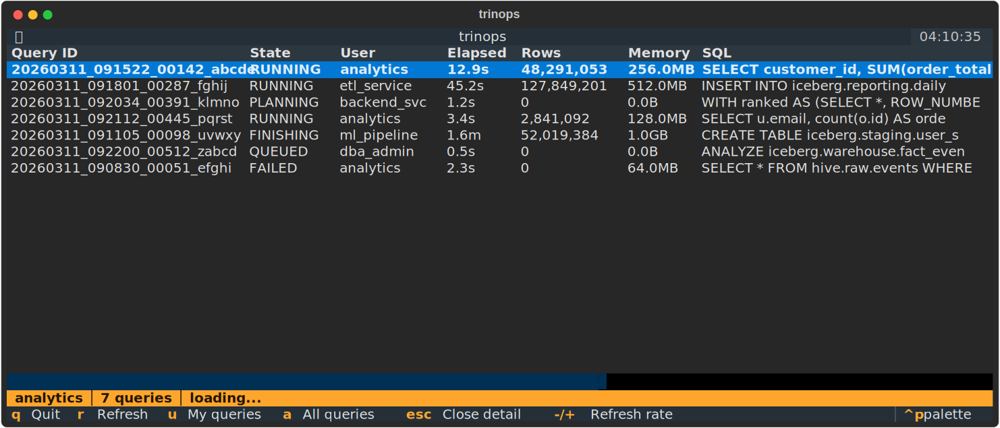

# trinops

[](https://github.com/lokkju/trinops/actions/workflows/test.yml)
[](https://pypi.org/project/trinops/)
[](https://pypi.org/project/trinops/)
[](https://polyformproject.org/licenses/shield/1.0.0/)

Trino query monitoring from the terminal. CLI commands for listing and inspecting queries, a live TUI dashboard, and a progress-tracking library for use in Python scripts.

<p align="center">
  
</p>

## Installation

```bash
pip install trinops
```

The default install includes the CLI and TUI dashboard. For tqdm progress bars in library usage:

```bash
pip install trinops[tqdm]
```

## Quick Start

Configure your Trino connection:

```bash
trinops config init
```

Or pass the server directly:

```bash
trinops queries --server trino.example.com:443
```

Or set environment variables:

```bash
export TRINOPS_SERVER=trino.example.com:443
export TRINOPS_USER=myuser
export TRINOPS_AUTH=basic
```

## CLI Usage

### List queries

```bash
# Your recent queries
trinops queries

# All users' queries
trinops queries --query-user all

# Filter by state
trinops queries --state RUNNING

# JSON output (pipe to jq, etc.)
trinops queries --json

# Select specific fields
trinops queries --select query_id,state,user,elapsed_time
```

### Inspect a single query

```bash
# Rich formatted detail
trinops query <query-id>

# Full REST API response as JSON
trinops query <query-id> --json

# Select specific fields from the raw response
trinops query <query-id> --select queryId,state,queryStats.elapsedTime,queryStats.peakUserMemoryReservation
```

### TUI dashboard

```bash
trinops tui
trinops top  # alias
```

The dashboard shows a live-updating table of queries with sorting, detail pane, and configurable refresh interval. Keybindings: `r` refresh, `u` toggle user filter, `a` show all, `-/+` adjust refresh rate, `q` quit.

## Configuration

Config file lives at `~/.config/trinops/config.toml`:

```toml
[default]
server = "trino.example.com:443"
scheme = "https"
user = "myuser"
auth = "none"
query_limit = 50

[profiles.prod]
server = "trino-prod.example.com:443"
auth = "oauth2"
```

### Authentication

Supported methods: `none`, `basic`, `jwt`, `oauth2`, `kerberos`.

```bash
# Check auth status
trinops auth status

# Run OAuth2 flow
trinops auth login
```

For `basic` auth, trinops uses the system keyring to store passwords securely.

## Library Usage

Wrap a trino cursor or connection to get live progress display during query execution:

```python
import trino
from trinops import TrinoProgress

conn = trino.dbapi.connect(host="trino.example.com", port=443, user="myuser")
cursor = conn.cursor()

with TrinoProgress(cursor) as tp:
    tp.execute("SELECT * FROM catalog.schema.table")
    rows = tp.fetchall()
```

You can also monitor an already-running query by passing a connection and query ID:

```python
with TrinoProgress(conn, query_id="20260310_143549_08022_abc") as tp:
    tp.start()
    tp.wait()
```

## Claude Code Integration

trinops ships with a [Claude Code skill](skills/trinops/SKILL.md) that teaches Claude how to query and inspect Trino cluster activity. If you have trinops installed in a project, Claude can use `trinops queries --select` and `trinops query <id> --select` to investigate query performance, find long-running queries, and diagnose failures with minimal context usage.

A [Claude Code plugin](/.claude-plugin/plugin.json) is also included for marketplace discoverability.

## Requirements

- Python 3.10+
- A running Trino cluster with the REST API accessible

## License

[PolyForm Shield 1.0.0](https://polyformproject.org/licenses/shield/1.0.0/)
