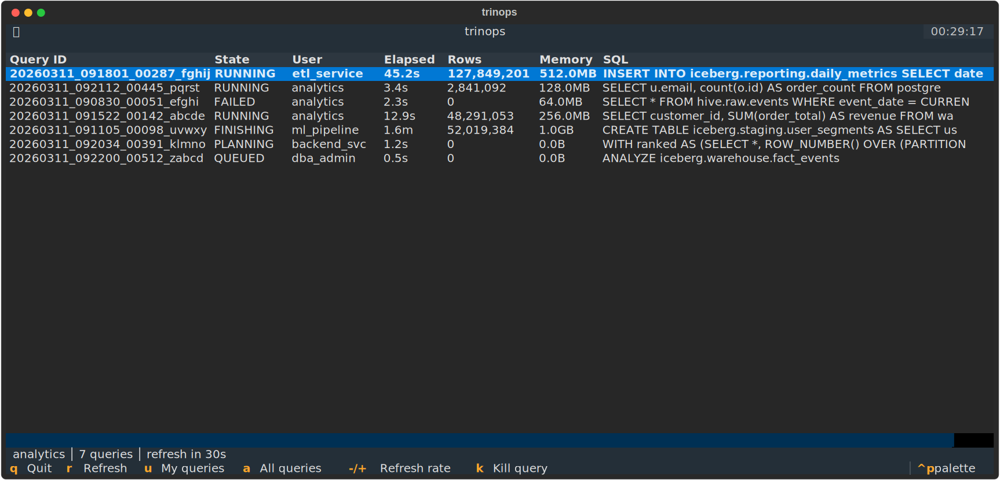
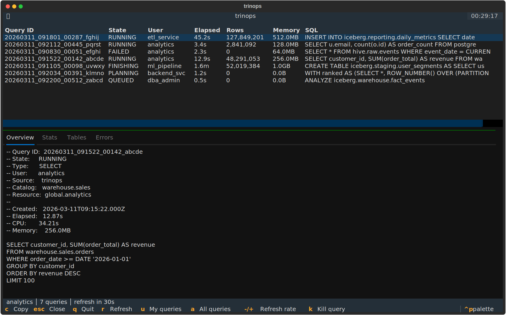

# TUI Dashboard

Launch the interactive dashboard with `trinops top` (or its alias `trinops tui`). It gives you a live, `htop`-style view of queries running on your Trino cluster.

## Layout

The dashboard has four regions stacked vertically:

1. **Cluster header** — a single dense line showing Trino version, uptime, worker count, running/queued queries, and aggregate CPU and memory.
2. **Query table** — one row per query with columns for Query ID, State, User, Elapsed, Rows, Memory, and a truncated SQL preview.
3. **Detail pane** — a tabbed view that opens below the query table when you select a row.
4. **Status bar** — shows the current user filter, query count, and a countdown to the next refresh.



## Keybindings

### Global

| Key | Action |
|-----|--------|
| `q` | Quit |
| `r` | Refresh immediately |
| `u` | Toggle between your queries and all users |
| `a` | Show all users |
| `k` | Kill the selected query (when `allow_kill` is enabled) |
| `-` / `+` | Decrease / increase refresh interval |
| `Tab` | Move focus to the next pane |
| `Shift+Tab` | Move focus to the previous pane |
| `Escape` | Close the detail pane |
| `Enter` | Open detail pane for the selected query |

### Detail pane

| Key | Action |
|-----|--------|
| `Up` / `Down` | Scroll the active tab |
| `Left` / `Right` | Switch between tabs |
| `Page Up` / `Page Down` | Scroll one page |
| `Home` / `End` | Jump to top / bottom |
| `c` | Copy the current tab's content to clipboard |
| `Escape` | Close the detail pane |

## Query table

### Columns

| Column | Description |
|--------|-------------|
| Query ID | The Trino-assigned query identifier |
| State | Current state: QUEUED, PLANNING, STARTING, RUNNING, FINISHING, FINISHED, FAILED |
| User | The Trino user who submitted the query |
| Elapsed | Wall-clock time since submission |
| Rows | Number of rows processed so far |
| Memory | Peak memory usage |
| SQL | First ~60 characters of the query text |

### Sorting

Click any column header to sort by that column. Click the same header again to reverse the sort order. The active sort column shows a caret indicator. The default sort is by Elapsed descending, so the longest-running queries appear first.

### User filter

By default the table shows only queries belonging to the configured user. Press `u` to toggle between your queries and all queries on the cluster, or press `a` to switch directly to the all-users view.

## Detail pane

Select a query (press `Enter` on a row) to open the detail pane. It fills the lower 60% of the screen and has four tabs:

| Tab | Content |
|-----|---------|
| Overview | Query ID, state, user, source, SQL text, resource group, session properties |
| Stats | Elapsed/CPU/queued/planning times, splits, rows, data processed, memory, spill |
| Tables | Input and output tables referenced by the query |
| Errors | Error type, code, and message (only populated for failed queries) |



Press `Escape` or the global `Escape` binding to close the pane and return focus to the query table.

## Kill workflow

Killing a query requires `allow_kill = true` in your profile (the default). When enabled, the `k` key is bound.

1. Select a query in the table or open its detail pane.
2. Press `k`.
3. If `confirm_kill = true` (the default), a confirmation dialog appears showing the query ID, user, and a SQL preview. Press `y` to confirm or `n` / `Escape` to cancel.
4. The status bar shows a flash message indicating success or failure.

To disable the kill command entirely, set `allow_kill = false` in your config. To skip the confirmation prompt, set `confirm_kill = false`.

## Copy to clipboard

With the detail pane open, press `c` to copy the active tab's text content to your system clipboard. This is useful for grabbing a full SQL statement or error message.

## Refresh interval

The default refresh interval is 30 seconds, configurable with `--interval`:

```bash
trinops top --interval 10
```

While the dashboard is running, press `-` to slow down the refresh rate or `+` to speed it up. The available steps are 5, 10, 15, 30, 60, 120, and 300 seconds.

## Empty state and errors

When there are no queries matching the current filter, the dashboard shows "No queries for &lt;user&gt;" (or "all users"). Refresh and filter changes update the message automatically.

Connection errors, auth failures, and other transient problems appear as flash messages in the status bar. The dashboard continues retrying on the regular refresh interval; it does not exit on transient errors.
