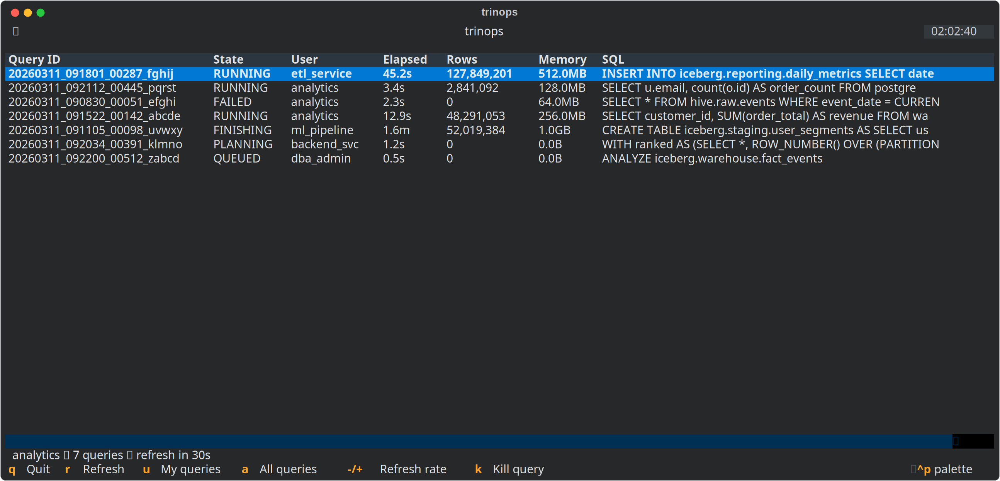
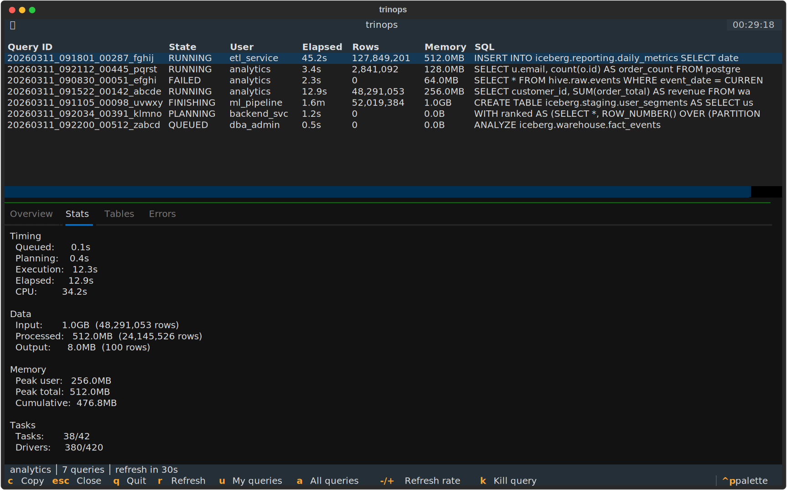
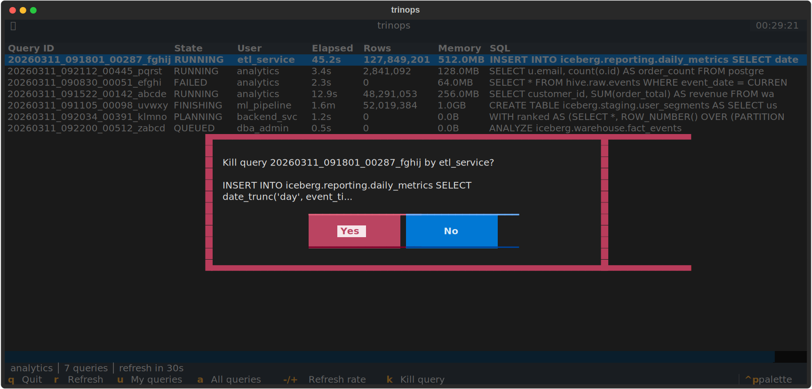

<section class="hero">
  

    
trino.ps

    
Trino query monitoring from the terminal.

    
    

      <button data-installer="uvx" class="active">uvx</button>
      <button data-installer="pipx">pipx</button>
      <button data-installer="pip">pip</button>
    

    <pre class="hero-install"><code data-install-command="install">uvx trinops install</code></pre>
    

      <a href="docs/getting-started/" class="hero-btn hero-btn--primary">Get Started</a>
      <a href="https://github.com/lokkju/trinops" class="hero-btn hero-btn--secondary">GitHub</a>
    

  

</section>

<section class="feature-cards-section">
  

    

      <h2>Command Line</h2>
      
List, inspect, and kill queries. Search schema metadata across catalogs. JSON output for scripting.

      <pre><code class="language-shell">trinops query list
trinops query kill &lt;query-id&gt;
trinops schema search --catalog hive keyword
trinops query list --json | jq '.[] | select(.state=="RUNNING")'</code></pre>
    

    

      <h2>Live Dashboard</h2>
      
Like htop for Trino. Live-updating query table with tabbed detail view, kill support, and cluster stats.

      
    

  

</section>

<section class="screenshot-gallery-section">
  <h2>Screenshots</h2>
  

    <figure>
      
      <figcaption>Query list with sort indicators</figcaption>
    </figure>
    <figure>
      
      <figcaption>Detail pane: Overview tab</figcaption>
    </figure>
    <figure>
      
      <figcaption>Detail pane: Stats tab</figcaption>
    </figure>
    <figure>
      
      <figcaption>Kill confirmation dialog</figcaption>
    </figure>
  

</section>

<section class="quick-start">
  <h2>Quick Start</h2>
  <ol class="quick-start-steps">
    <li>
      <strong>Configure</strong>
      <pre><code data-install-command="config init --server trino.example.com --user myuser">uvx trinops config init --server trino.example.com --user myuser</code></pre>
    </li>
    <li>
      <strong>Authenticate</strong>
      <pre><code data-install-command="config set auth oauth2">uvx trinops config set auth oauth2</code></pre>
      <pre><code data-install-command="auth login">uvx trinops auth login</code></pre>
    </li>
    <li>
      <strong>Go</strong>
      <pre><code data-install-command="top">uvx trinops top</code></pre>
    </li>
  </ol>
</section>

<footer class="landing-footer">
  

    <a href="docs/getting-started/">Documentation</a>
    <a href="https://github.com/lokkju/trinops">GitHub</a>
    <a href="https://pypi.org/project/trinops/">PyPI</a>
    <a href="https://github.com/lokkju/trinops/issues">Issues</a>
  

  
Built by Loki Coyote &middot; A community tool for the <a href="https://trino.io">Trino</a> ecosystem &middot; PolyForm Shield 1.0.0

</footer>
